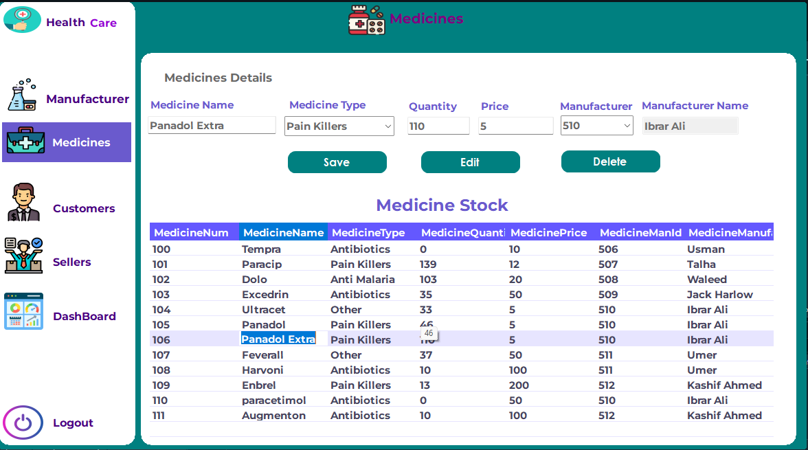
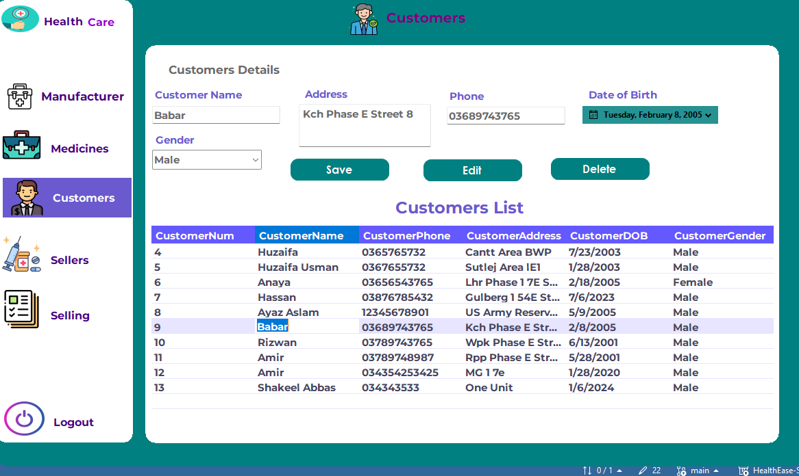
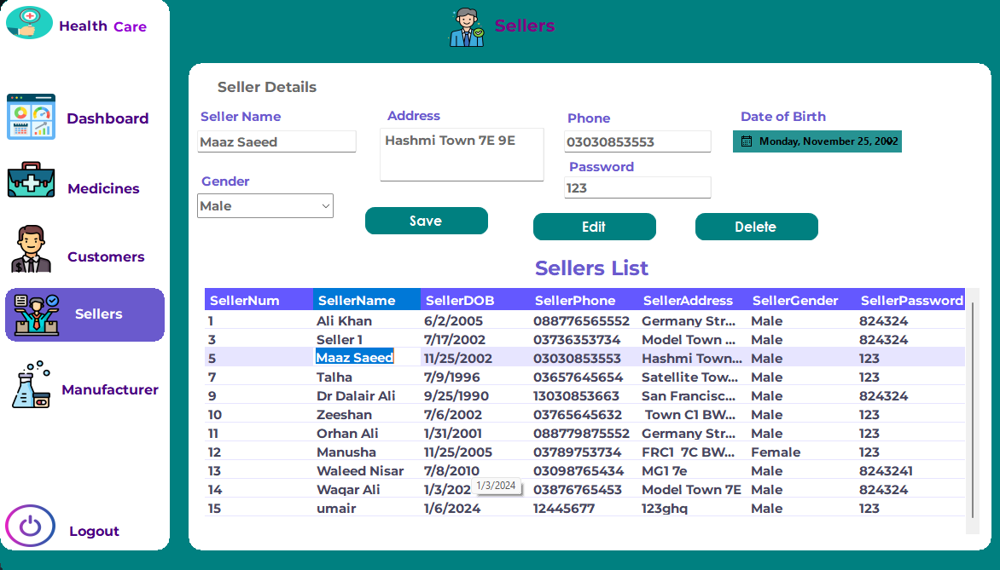
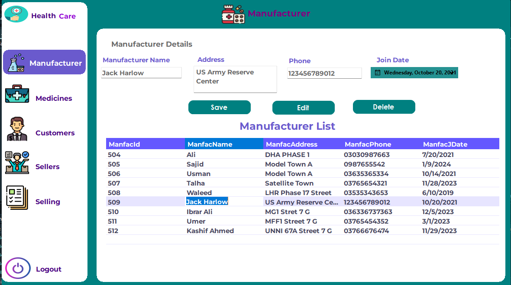

                                                ## Health Ease System (Windows Desktop Application)

This is a Health Ease System developed using C# and Windows Forms for the frontend interface. It uses SQL Server for the backend database.

## Design Interface 

💫💫💫Dashboard Panel: 

  In my Dashboard Panel  is part of a Pharmacy Management System in C# Windows Forms. It provides a visual dashboard displaying counts of medicines, sellers, and customers, along with total sales. 
  
1. 

💫💫💫   Medicine Cell :

   The Medicine file manages medicine information in a Pharmacy Management System using C# Windows Forms. It allows adding, updating, and deleting medicines, along with viewing details

   
  2. 

💫💫💫 Customer Section:
The Customer file handles customer records in a Pharmacy Management System with C# Windows Forms. It includes functionalities for adding, updating, and deleting customer information.

5. 

💫💫💫  Seller:

The Sellers file oversees seller-related functionalities in a Pharmacy Management System with C# Windows Forms. It facilitates the addition, update, and deletion of seller information.

   
6. 
   

💫💫💫   Manufacturer Section:

   The Manufacturer file is responsible for managing manufacturer details in a Pharmacy Management System using C# Windows Forms. It provides features to add, update, and delete manufacturer records.

7. 

## Features

- **Medicine Management**: Allows users to add, update, and delete medicines with details such as name, type, quantity, price, and manufacturer.
- **Customer Management**: Enables managing customer records including name, address, phone, DOB, and gender.
- **Dashboard**: Provides an overview of the system, including the count of medicines, customers, sellers, total sales, and highlights best sellers and customers.
- **Navigation**: Simple and intuitive navigation across different sections of the system.

## Technologies Used

- C#
- Windows Forms
- SQL Server (LocalDB)

## Setup Instructions

1. Clone the repository:

2. Database Setup:
- Ensure SQL Server is installed.
- Attach the provided `PharmacySystemDB.mdf` file to your SQL Server instance.
- Update the connection string in the code to match your SQL Server instance.

3. Open the project in Visual Studio:
- Ensure you have Visual Studio installed to run and modify the project.

## Usage

- Open the project in Visual Studio.
- Build and run the solution.
- Navigate through different sections:
- **Medicines**: Manage medicines, their types, quantities, prices, and manufacturers.
- **Customers**: Add, update, or delete customer records.
- **Dashboard**: Get an overview of system statistics and sales details.

## Contributors

- ## Developer
- Syed Maaz Saeed

  - ## Email
  - syedmaazsaeed@gmail.com

